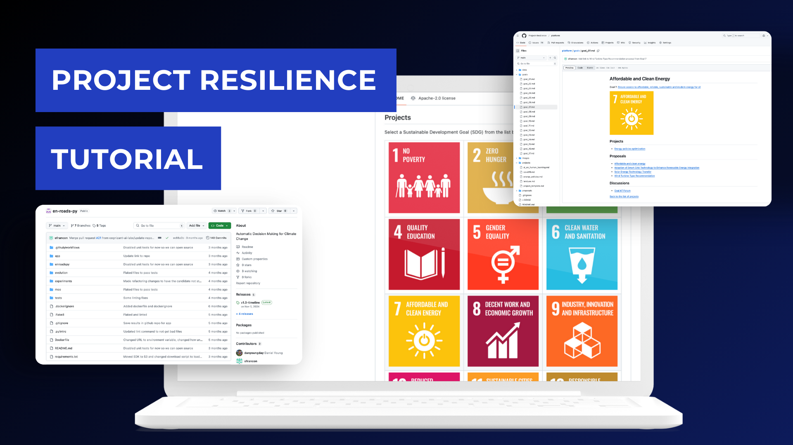

# Project Resilience
Project Resilience's platform for decision makers, data scientists and the public.

[Project Resilience](https://www.itu.int/en/ITU-T/extcoop/ai-data-commons/Pages/project-resilience.aspx),
initiated under the Global Initiative on AI and Data Commons, is a collaborative effort
to build a public AI utility that could inform and help address global decision-augmentation challenges.

The project empowers a global community of innovators, thought leaders, and the public to enhance and use
a shared collection of data and AI tools, improving preparedness, intervention, and response to environmental,
health, information, or economic threats in our communities.
It also supports broader efforts toward achieving the [Sustainable Development Goals (SDGs)](https://sdgs.un.org/).

More info about Project Resilience [here](https://www.itu.int/en/ITU-T/extcoop/ai-data-commons/Pages/project-resilience.aspx).

Click [here](https://huggingface.co/spaces/projectresilience/projectresilience-assistant) to chat with Project Resilience Assistant to know more about it.

## Volunteers

If you would like to get involved:
- Browse through the SDGs below
- Find a project that interests you
- Or find a proposal that interests you
- Or look at the discussions for this SDG and brainstorm with the community

Find us on Slack at: [bit.ly/project-resilience](http://bit.ly/project-resilience).

## How to navigate the platform

## Projects

Select a Sustainable Development Goal (SDG) from the list below to view projects for that goal.

<!-- Note: using reference-style links to let Jekyll's relative links
convert them to .html in GitHub pages -->
[goal_01_link]: goals/goal_01.md
[goal_02_link]: goals/goal_02.md
[goal_03_link]: goals/goal_03.md
[goal_04_link]: goals/goal_04.md
[goal_05_link]: goals/goal_05.md
[goal_06_link]: goals/goal_06.md
[goal_07_link]: goals/goal_07.md
[goal_08_link]: goals/goal_08.md
[goal_09_link]: goals/goal_09.md
[goal_10_link]: goals/goal_10.md
[goal_11_link]: goals/goal_11.md
[goal_12_link]: goals/goal_12.md
[goal_13_link]: goals/goal_13.md
[goal_14_link]: goals/goal_14.md
[goal_15_link]: goals/goal_15.md
[goal_16_link]: goals/goal_16.md
[goal_17_link]: goals/goal_17.md

| [][goal_01_link] | [][goal_02_link] | [][goal_03_link]              |
|-----------------------------------------------------------|-----------------------------------------------------------|------------------------------------------------------------------------|
| [][goal_04_link] | [][goal_05_link] | [][goal_06_link]              |
| [][goal_07_link] | [][goal_08_link] | [][goal_09_link]              |
| [][goal_10_link] | [][goal_11_link] | [][goal_12_link]              |
| [][goal_13_link] | [][goal_14_link] | [][goal_15_link]              |
| [][goal_16_link] | [][goal_17_link] |  |

## Contributing

### Roles

Users of the platform can have different profiles, such as:
- **Decision Makers**: Users who make decisions based on the data and insights provided by the platform.
- **Technical contributors**: Users who gather data, analyze data, train models, create UIs, deploy applications
to provide insights to decision makers.
- **Public**: Users who are interested in learning about the projects and proposals on the platform, 
and may provide feedback or suggestions.
- **Moderators**: Users who review and approve proposals and projects submitted to the platform.

### Data

Each project relies on data. Please read the [data guidelines](data/data_guidelines.md) to learn how to contribute data.

### Proposals

Proposals can be submitted by creating a new file in the `proposals` directory and linking it to the
corresponding SDGs. Please follow the [proposal template](proposals/proposal_template.md) when creating a new proposal.

### Projects

Projects can be submitted by creating a new file in the `projects` directory and linking it to the
corresponding SDGs. Please follow the [project template](projects/project_template.md) when creating a new project.