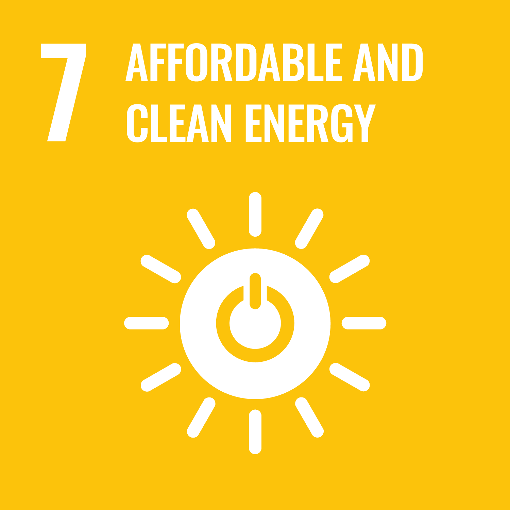

# Project title

<!-- Describe the project in one sentence, e.g. A project that... -->
The aim of the project is to develop tools to help energy planners identify non-renewable energy plants with promising potential for repurposing as solar, wind, storage or grid-support facilities.

<!-- Note: using reference-style links to let Jekyll's relative links
convert them to .html in GitHub pages -->

<!-- Affordable and clean energy -->
[goal_07_link]: ../goals/goal_07.md 
<!-- Industry, Innovation, and Infrastructure -->
[goal_09_link]: ../goals/goal_09.md 
<!-- Climate Action -->
[goal_13_link]: ../goals/goal_13.md 

<!-- Insert SDG Icons and links-->
| [][goal_07_link] | [][goal_09_link] | [][goal_13_link] |
|------------------------------------------------------|------------------------------------------------------|-------------------------------|

## Decision makers

- Energy program managers
- Policy makers
- Business leaders

## Objectives

<!-- Describe the objectives of the project in one sentence -->
To identify data sources and develop tools useful for energy planners during the identification of plants to convert to sustainable energy.

## Deliverables

What will be built for this project?

- [ ] Dashboard
- [ ] Dataset and data sources
- [ ] Publications

## Data attributes

### Context

Data that could be taken into account for the decision:
- Plant age, status, capacity, generation and emissions
- Site area, slope, contamination and water use
- Solar/wind resource
- Grid connection and system requirements
- Workforce and community dependence

### Actions

Possible decisions to make:
- Retire plant and install solar/wind/biofuel/...
- Choose transition date and investment level
- Reuse equipment as grid support

### Outcomes

The tool should show separate dimensions rather than one suitability score:
- Transition urgency: age, retirement status, utilization and emissions.
- Renewable potential: solar, wind and available land.
- Grid/system value: existing connection, replacement capacity and storage needs.
- Economic feasibility: indicative CAPEX, LCOE, remediation and infrastructure reuse.
- Social/environmental feasibility: employment, local tax dependence, pollution burden, land rights and community preferences.
- Data confidence: freshness, missing fields and coordinate accuracy.

The target metrics could be:
- Annual renewable MWh expected production vs current non-renewable MWh
- Avoided CO2 and pollution

## Data

The project will use GEM, Climate TRACE, renewable-resource atlases, national plant/grid data, and the En-ROADS simulator

## Code

<!-- Point to the repo that contains the code -->
(none)

## Needs

List of needs:
- Data sources
- Contact with decision makers

## Contributors needed

- power-systems engineer
- renewable-energy analyst
- data engineers
- project-finance specialist
- environmental expert
- UX developer
- stakeholder-engagement lead.

## References

<!-- Provide a list of references or other resources used in the project -->
- https://github.com/Project-Resilience/mvp/blob/main/data/global_energy_monitor.py
- https://globalenergymonitor.org/projects/global-oil-gas-plant-tracker 
    - capacity, status, start/retirement dates, ownership, technology and coordinates. The current release is January 2026 and generally uses CC BY 4.0.
    - Mainly covers coal units of 30 MW or more; some coordinates are approximate. Download requires a form.
- https://climatetrace.org/data
    - source-level emissions, ownership and confidence information.
    - API is beta; use cached bulk downloads for reliability. Records must be carefully matched to GEM plants.
- Solar potential: https://datacatalog.worldbank.org/search/dataset/0038641/world-photovoltaic-power-potential-pvout-gis-data-global-solar-atlas
    - Preliminary resource assessment, not a bankable site study.
- Wind potential: https://globalwindatlas.info/
    - Local measurements and engineering studies would still be required.
- https://documents1.worldbank.org/curated/en/144181629878602689/pdf/Coal-Plant-Repurposing-for-Ageing-Coal-Fleets-in-Developing-Countries-Technical-Report.pdf
    - Coal plant repurposing framework from the worldbank.
- IRENA renewable cost study: https://www.irena.org/Publications/2025/Jun/Renewable-Power-Generation-Costs-in-2024

## Discussion

<!-- Provide a link to a space for discussion or comments -->
(no discussion yet)

[Back to the list of projects](../README.md)